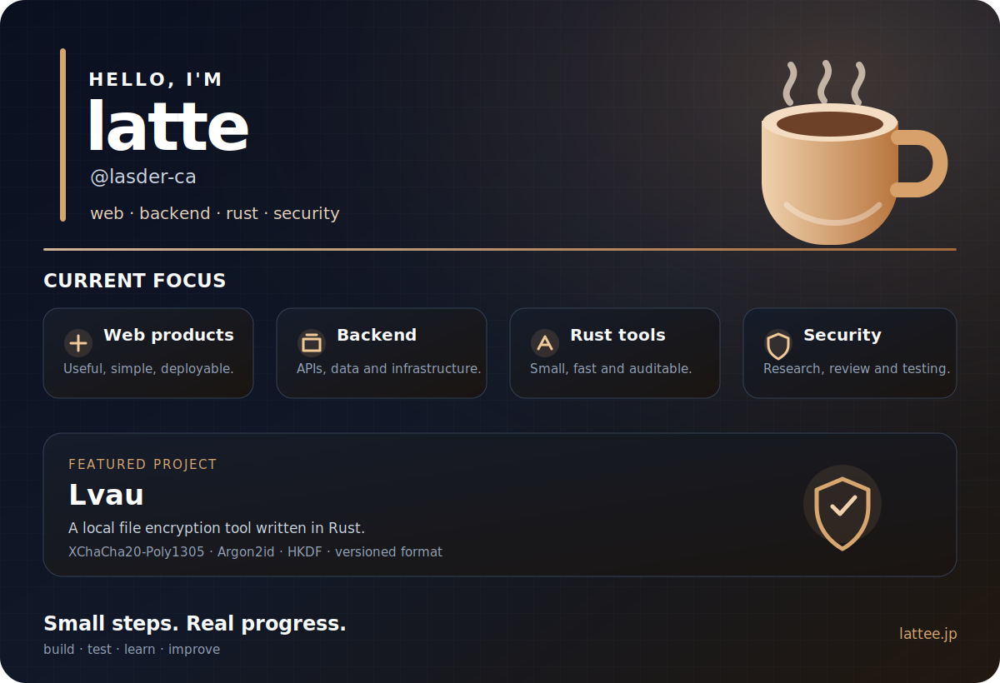

  

<h1 align="center">latte / @lasder-ca</h1>

  Student developer in Japan building secure local tools, reproducible AI infrastructure, and practical web systems.

  <a href="https://lattee.jp">Website</a>
  &nbsp;·&nbsp;
  <a href="https://github.com/latteworkspace/lvau">Lvau</a>
  &nbsp;·&nbsp;
  <a href="https://github.com/lasder-ca/PatchArena">PatchArena</a>
  &nbsp;·&nbsp;
  <a href="https://github.com/lasder-ca?tab=repositories">Repositories</a>

## About

I build software by turning ideas into working, testable systems. My main interests are security-focused developer tools, AI coding-agent evaluation, backend and edge infrastructure, and automation.

- Based in Japan
- Working mainly with **Rust**, **TypeScript**, and **Go**
- Using **GitHub Actions**, **WSL2**, **Cloudflare**, and **Vercel**
- Interested in cryptography, local-first tools, AI agents, reproducibility, and secure deployment

## Featured work

| Project | What it does | Selected highlights |
|---|---|---|
| [**Lvau**](https://github.com/latteworkspace/lvau) | A secure-by-default Rust toolkit for encrypted local files and developer workflows. | XChaCha20-Poly1305, Argon2id, signed capsules, sealed bundles, recovery shares, recipient rekeying, CLI and native GUI, cross-platform releases. |
| [**PatchArena**](https://github.com/lasder-ca/PatchArena) | A reproducible benchmark runner for evaluating AI coding agents on real repositories. | Fresh Git worktrees, repeatable tasks, policy checks, audit evidence, run comparison, HTML/JSON/Markdown reports, Codex/Claude/Gemini adapters. |
| [**lattee.jp**](https://lattee.jp) | My website and public home for projects, notes, and experiments. | Web development, deployment, project documentation, and practical infrastructure work. |

## Selected outcomes

- Shipped versioned Lvau releases with Linux, Windows, and macOS artifacts.
- Built encrypted capsule workflows with signing, recovery, structured-secret handling, and explicit security documentation.
- Built a coding-agent benchmark that records exact repository revisions, patches, logs, verification results, and policy violations.
- Added repeatable benchmark suites, resumable execution, machine-readable evidence, and self-contained reports.
- Maintains English and Japanese documentation alongside CI, tests, linting, release notes, security policies, and threat models.

## Stack

`Rust` · `TypeScript` · `Go` · `JavaScript` · `HTML/CSS` · `GitHub Actions` · `Linux/WSL2` · `Cloudflare` · `Vercel` · `Docker` · `Git`

## Current focus

- Making security tools easier to inspect, automate, and use correctly
- Evaluating AI coding agents with evidence instead of one-off demos
- Building lightweight web and edge systems with clear operational boundaries

  <a href="https://lattee.jp">lattee.jp</a>

