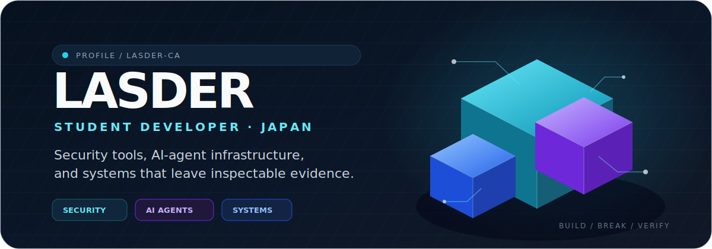

  

   

  
  
  

 

<table>
  <tr>
    <td width="33%" valign="top">
      <h3>🔐 Security</h3>
      
Local-first encryption, threat modeling, abuse-case testing, and security research with reproducible evidence.

    </td>
    <td width="33%" valign="top">
      <h3>🧠 AI agents</h3>
      
Evaluation infrastructure that preserves patches, logs, test results, and the reasoning evidence needed for review.

    </td>
    <td width="33%" valign="top">
      <h3>⚙️ Systems</h3>
      
Rust, Go, TypeScript, Linux, edge infrastructure, CI, releases, and automation built around inspectable behavior.

    </td>
  </tr>
</table>

## Featured work

  <a href="https://github.com/latteworkspace/lvau">
    <picture>
      <source media="(prefers-color-scheme: dark)" srcset="https://github-stats-extended.vercel.app/api/pin/?username=latteworkspace&amp;repo=lvau&amp;theme=github_dark&amp;hide_border=true&amp;show_owner=true">
      <source media="(prefers-color-scheme: light)" srcset="https://github-stats-extended.vercel.app/api/pin/?username=latteworkspace&amp;repo=lvau&amp;theme=default&amp;hide_border=true&amp;show_owner=true">
      
    </picture>
  </a>
  <a href="https://github.com/lasder-ca/PatchArena">
    <picture>
      <source media="(prefers-color-scheme: dark)" srcset="https://github-stats-extended.vercel.app/api/pin/?username=lasder-ca&amp;repo=PatchArena&amp;theme=github_dark&amp;hide_border=true">
      <source media="(prefers-color-scheme: light)" srcset="https://github-stats-extended.vercel.app/api/pin/?username=lasder-ca&amp;repo=PatchArena&amp;theme=default&amp;hide_border=true">
      
    </picture>
  </a>

  <a href="https://github.com/lasder-ca/aegis-acbs">
    <picture>
      <source media="(prefers-color-scheme: dark)" srcset="https://github-stats-extended.vercel.app/api/pin/?username=lasder-ca&amp;repo=aegis-acbs&amp;theme=github_dark&amp;hide_border=true">
      <source media="(prefers-color-scheme: light)" srcset="https://github-stats-extended.vercel.app/api/pin/?username=lasder-ca&amp;repo=aegis-acbs&amp;theme=default&amp;hide_border=true">
      
    </picture>
  </a>

- **[Lvau](https://github.com/latteworkspace/lvau)** — recoverable encrypted capsules for local files and developer workflows, written in Rust. Experimental and not formally audited.
- **[PatchArena](https://github.com/lasder-ca/PatchArena)** — reproducible evaluation for AI coding agents in isolated Git worktrees, with patches, logs, checks, and machine-readable evidence.
- **[Aegis ACBS](https://github.com/lasder-ca/aegis-acbs)** — experimental road-network routing research focused on adaptive bidirectional search and reproducible real-map benchmarks.

## 3D contribution map

  

The map is regenerated automatically from current GitHub contribution data.

## Activity

<picture>
  <source media="(prefers-color-scheme: dark)" srcset="https://github-readme-activity-graph.vercel.app/graph?username=lasder-ca&amp;theme=github-compact&amp;hide_border=true&amp;area=true&amp;days=60&amp;custom_title=Contribution%20Activity">
  <source media="(prefers-color-scheme: light)" srcset="https://github-readme-activity-graph.vercel.app/graph?username=lasder-ca&amp;theme=github&amp;hide_border=true&amp;area=true&amp;days=60&amp;custom_title=Contribution%20Activity">
  
</picture>

  <picture>
    <source media="(prefers-color-scheme: dark)" srcset="https://github-profile-summary-cards.vercel.app/api/cards/repos-per-language?username=lasder-ca&amp;theme=github_dark&amp;exclude_repos=EdgeChains,lasder-ca&amp;animation=draw&amp;duration=2">
    <source media="(prefers-color-scheme: light)" srcset="https://github-profile-summary-cards.vercel.app/api/cards/repos-per-language?username=lasder-ca&amp;theme=github&amp;exclude_repos=EdgeChains,lasder-ca&amp;animation=draw&amp;duration=2">
    
  </picture>
  <picture>
    <source media="(prefers-color-scheme: dark)" srcset="https://github-profile-summary-cards.vercel.app/api/cards/stats?username=lasder-ca&amp;theme=github_dark&amp;animation=load&amp;duration=2">
    <source media="(prefers-color-scheme: light)" srcset="https://github-profile-summary-cards.vercel.app/api/cards/stats?username=lasder-ca&amp;theme=github&amp;animation=load&amp;duration=2">
    
  </picture>

## Stack

  

  <code>build</code> · <code>break</code> · <code>verify</code>
    
  <a href="https://lattee.jp">lattee.jp</a>
  &nbsp;·&nbsp;
  <a href="https://github.com/lasder-ca?tab=repositories">all repositories</a>

