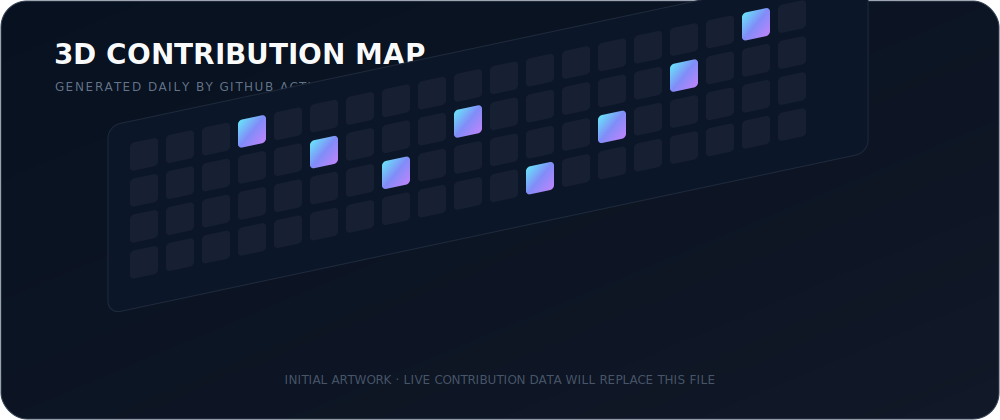

  

  
<strong>Student developer from Japan building security tools, AI-agent infrastructure, and systems software.</strong>

  
作って、壊して、検証しながら、セキュリティ・AI・プログラミングを学んでいます。

  
  
  

## What I build

<table>
  <tr>
    <td width="33%" valign="top">
      <strong>Security</strong>  
      Local-first encryption, threat modeling, abuse-case testing, and reproducible vulnerability research.
    </td>
    <td width="33%" valign="top">
      <strong>AI agents</strong>  
      Evaluation infrastructure that preserves patches, logs, checks, and reviewable evidence.
    </td>
    <td width="33%" valign="top">
      <strong>Systems</strong>  
      Rust, Go, TypeScript, Linux, edge infrastructure, CI, releases, and automation.
    </td>
  </tr>
</table>

## Featured projects

  
  

  

- **[Lvau](https://github.com/latteworkspace/lvau)** — Rust製の、ローカルファイル向け暗号化ツール。現在は実験段階で、正式なセキュリティ監査は未実施です。
- **[PatchArena](https://github.com/lasder-ca/PatchArena)** — AI coding agentを隔離されたGit worktreeで評価し、patch・log・検証結果を保存する再現可能なベンチマーク基盤です。
- **[Aegis ACBS](https://github.com/lasder-ca/aegis-acbs)** — 実地道路グラフを使い、適応的な双方向最短経路探索を検証する研究プロジェクトです。

## 3D contributions

  

## GitHub overview

  
  

  

## Tech stack

  

  Community components: capsule-render · github-profile-3d-contrib · github-readme-stats · github-readme-activity-graph · skillicons

  

