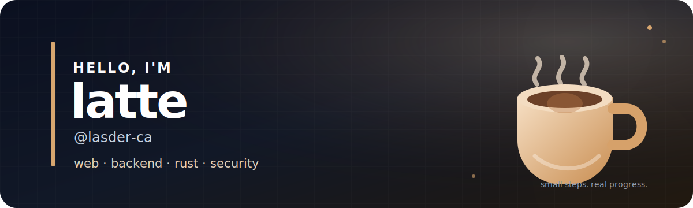
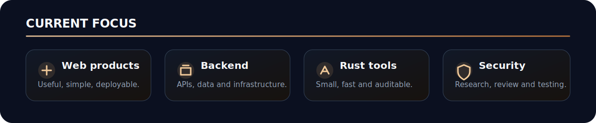
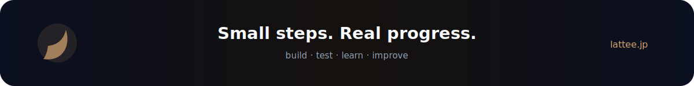

  

  <a href="https://lattee.jp"><strong>lattee.jp</strong></a>
  &nbsp;·&nbsp;
  <a href="https://github.com/lasder-ca?tab=repositories">Repositories</a>

## About

Web、バックエンド、Rust、セキュリティ周辺のものを作っている **latte** です。

思いついたものを小さく動かして、試しながら直していくのが好きです。  
最近は API・データベース・インフラ寄りの開発と、セキュリティリサーチに取り組んでいます。

  

## Featured project

### [Lvau](https://github.com/lasder-ca/lvau)

Rust製のローカルファイル暗号化ツール。  
安全なデフォルト、確認しやすい実装、長く保守できる形式を目指して開発しています。

- XChaCha20-Poly1305
- Argon2id
- HKDFによる鍵分離
- バージョン付きファイル形式

  

## What I use

`Rust` · `TypeScript` · `Python` · `PostgreSQL` · `Docker` · `Linux`

まだ何でもできるわけではないけど、フロントだけ・バックエンドだけに閉じず、  
必要なところを自分で追える開発者を目指しています。

  <a href="https://lattee.jp">Website</a>
  &nbsp;·&nbsp;
  <a href="https://github.com/lasder-ca">GitHub</a>

  

